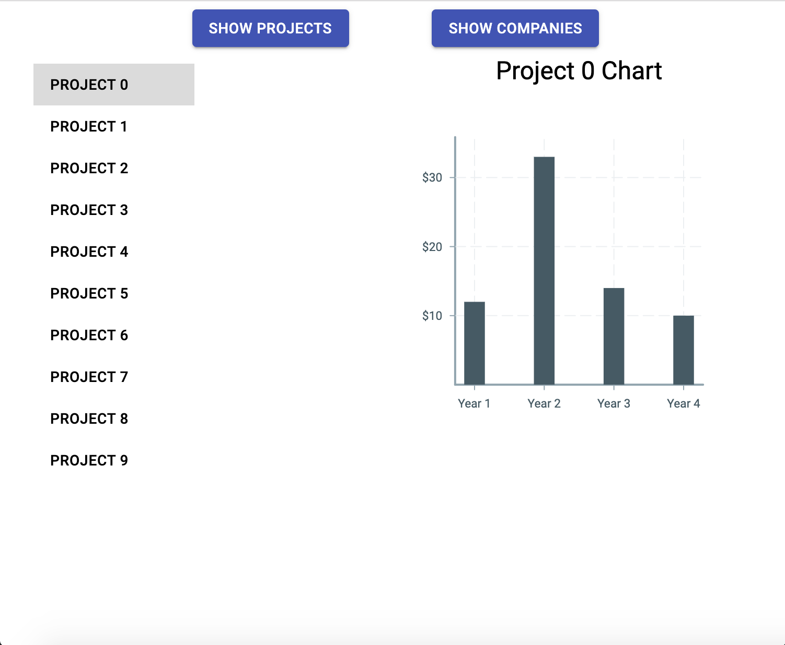
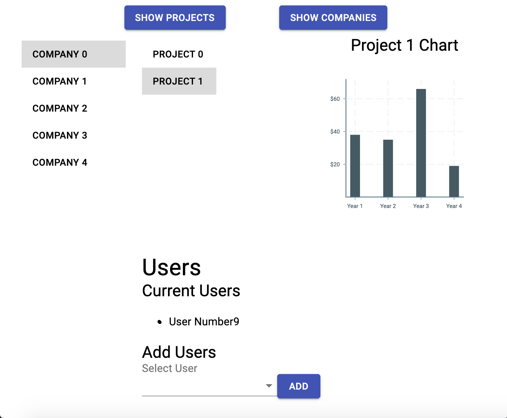
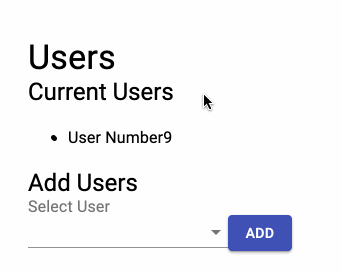

# Avalanche Take Home Exercise

Hello! Thank you for taking the time to work through this take home exercise. In this
README we will set out the guidelines we want you to follow, the goals of the exercise,
how to get setup, and some resources to help you along.

# Submission

When you're done with the exercise, please remove the `frontend/node_modules` directory, zip the remaining files, and send an email to mark [at] avalanchestrategy [dot] com. Please include `Engineering Takehome Submission` as the subject. You can either attach the zip file, or send a link to a hosted version (i.e. a Google Drive or Dropbox link).

Please do not fork this repository. While that would certainly be the most convenient way to go about sharing code, we want everyone to have a fair opportunity, and don't want future candidates to see potential solutions.

# Guidelines

We want to be respectful of your time, so
we're asking everyone to limit their time on the exercise to 2 hours. We don't expect
you to finish everything in that time. If you do, that's great, but don't worry if
you don't. Please get as far as you can, but keep to the time frame.

Because the exercise is written in Django/Python
(backend) and React (frontend), feel free to add up to 30 minutes for each technology
you're not familiar with. i.e. if you don't know Django and React add 1 hour to the
2 hour time limit. That said, the goal of the exercise is to assess your engineering
skills, not to see how well you know the Django framework. We've tried to design it
in a way that you can get by without knowing all aspects of the technologies we use.
Using stack overflow, tutorials, copying code from within the project are all fair game.
We want you to use any resources you'd normally use in your work.

# Goals

This section has a high-level description of the changes you're being asked to make to the
project, but to understand exactly what you'll be graded on, we recommend you 
consult `customer_data/tests.py` directly. This contains all of the automated
tests that will be evaluated when checking your solution.

## Tasks, in order of complexity (WORK IN PROGRESS)
- Easy Django things?
- Get the Companies.jsx page to work
- Get the Profiles.jsx page to work
- Get updates to the Profiles page to work? To Companies? Etc.

At Avalanche we're building out systems to help us provide insights to our clients.
Currently, we're building internal tools for our team to quickly access the information
they need for each project we work on. The app allows our team to view each project we work on.

## Companies View

The product team has requested that
we provide better organization as we grow. Instead of a single page with all the projects
listed, the team wants to be able to view projects by company. Clicking on the "Show Companies" button will switch to the company view. Currently it has just a text placeholder, but we want you to make it look like this:

Clicking on a company should reveal a menu of projects associated with that company.
The menu of projects should function just like the existing projects page does,
where clicking on a project brings up the relevant chart for the project.

Places to get started:
- We need to add the UI. Checkout the `frontend/src/components/Companies.jsx` file.
Look to the Projects component at `frontend/src/components/Projects.jsx` for inspiration.
- We need to hook the UI up to our companies API. The companies index endpoint is at `customer_data/companies`, look at how we make requests in `frontend/src/App.jsx` for inspiration.
- You should reuse the projects component on this page.
- This feature is exercised in the `test_companies` test. `docker-compose run web python manage.py test customer_data.tests.CustomerDataTests.test_companies` runs just this test.

## User Admin

In preperation of releasing our project views externally, we need to build a view where an admin can associate a user with a company. We have an association between the user profile model
and company model that enables us to assign users a company.

We need to add a Select menu where a user can associate any user profile in the database
with the relevant company. When a user clicks on the Add button, the user profile should
be associated in the database and the UI should be updated.

Places to get started:
- We need to add an endpoint to update user profiles. Check out the `customer_data/serializers.py` file.
We use [Django Rest Framework](https://www.django-rest-framework.org/api-guide/serializers/#serializers).
- We need to add the UI. Checkout the `frontend/src/components/Users.jsx` file. It's not rendered anywhere,
but now that you've implemented the company page, we have a place to render it. Use MUI components
[Selects](https://material-ui.com/components/selects/) and [Buttons](https://material-ui.com/components/buttons/)
- Hint: if you're having trouble getting the update endpoint to work, you can focus on just building the UI. Adding a user could add it to the page locally but not fire an AJAX request to update it on the backend. This is a good first step! You can test this functionality in `test_user_assignment_no_refresh` by running `docker-compose run web python manage.py test customer_data.tests.CustomerDataTests.test_user_assignment_no_refresh`
- Some of the more complex tests deal with edge case scenarios. Think of solving these as extra credit:
  - `test_can_change_user_assignment`: ensures that adding a user to one company removes them from whatever company they were assigned to before.
  - `test_user_assignment_dropdown_only_has_available_users`: ensures that the select dropdown only has users that aren't already part of this company.

# Setup

We've dockerized this exercise to make setup as painless as possible. Make sure you have [docker](https://docs.docker.com/get-started/#install-docker-desktop)
and [docker-compose](https://docs.docker.com/compose/install/) installed, AND updated to the most recent version. If you get an error, make sure docker is running before you use these commands. ([Docker Desktop](https://hub.docker.com/editions/community/docker-ce-desktop-mac) is an easy way to do this.)

Now, clone this repository and in the root directory run `docker-compose build` and then
`docker-compose up`. Building might take a few minutes as it gathers all the needed dependencies. The first time you launch the containers it will also take some time to download all the JS packages.
Once up, you'll need to run: `docker-compose run web python manage.py migrate`
Then you can access the server at `localhost:8000`. The webpack bundle is served
from a development server meaning building the frontend should be fast, and hot module
reloading is on, so you shouldn't even need to refresh the app to see the updates.

To stop the containers, type `ctrl + c`

You can seed the database by running `docker-compose run web python manage.py seed`

You shouldn't need to install additional dependencies, but if you really want to, you can.

## JavaScript dependencies
Run `docker-compose exec frontend yarn add <dependency name>`

## Python dependencies
Add the dependency to the `requirements.txt` file, then re-build the image:
`docker-compose web build`.

# Tests

The setup comes with tests (`customer_data/tests`) to check your work. These are selenium (browser tests)
because we don't want to be prescriptive in how you approach the problem. We only
care that the functionality is there. To run the tests open a _separate_ terminal window
(in other words, do _not_ shut down the running website) and run:
`docker-compose run web python manage.py test customer_data.tests.CustomerDataTests`.
This will run the tests in a separate selenium docker container. To watch the
tests you can install [VNC](https://www.realvnc.com/en/connect/download/viewer/) and
connect to `0.0.0.0:5900`. You will need to sign up for a free VNC account, and 
log in to the software, or else you will get an unhelpful error message.
Then, when VNC asks you for a password (but no username) to 
Authenticate to VNC Server, use the password "secret". (We did not choose this password.)
This can be useful when debugging as you can put a breakpoint
in a test to see where it's failing. Go to the `customer_data/tests.py` file and
add a `pdb.set_trace()` wherever you'd like the test to stop.

You should ensure the tests are passing for any feature you complete as that is
part of how we will evaluate your work.

You are welcome to write other tests if you would like, but you do not have to.

# Resources

[React quick start guide](https://reactjs.org/docs/hello-world.html)

[Django tutorial](https://docs.djangoproject.com/en/2.2/intro/tutorial01/)

[MUI Docs](https://material-ui.com/)

[Django Rest Framework](https://www.django-rest-framework.org/api-guide/serializers/#serializers)
